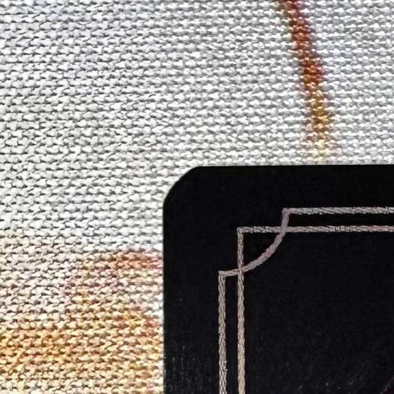
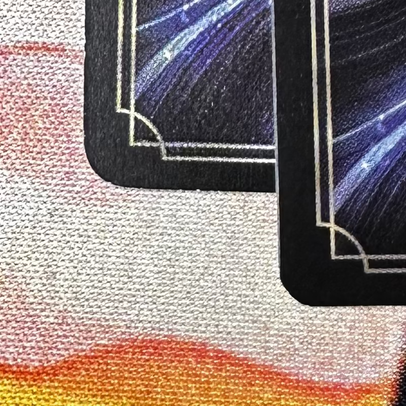
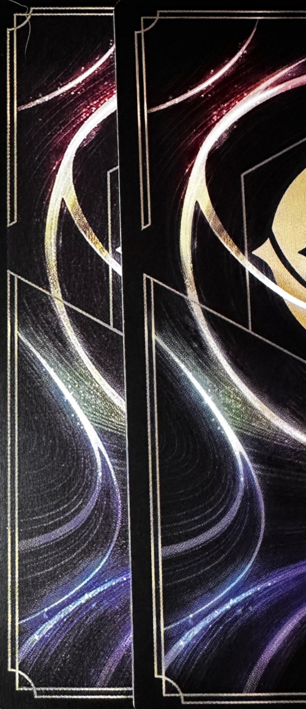
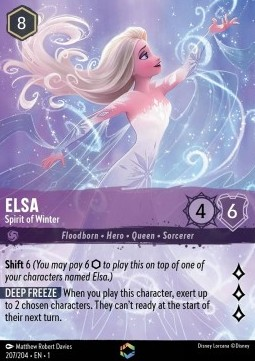
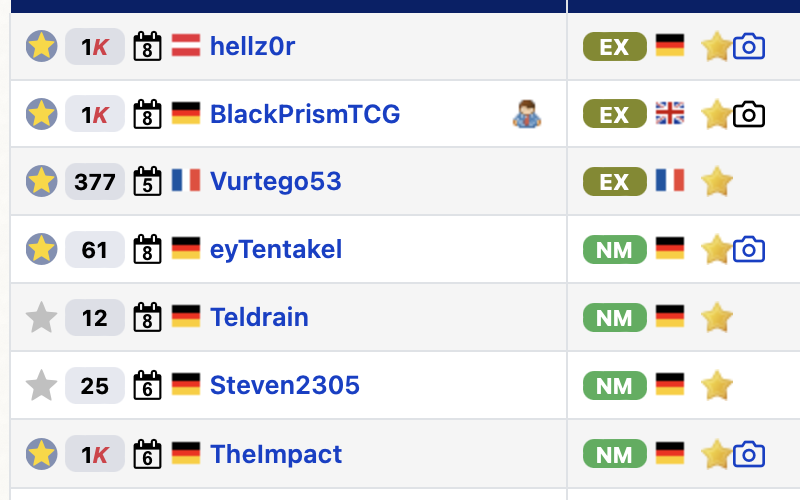
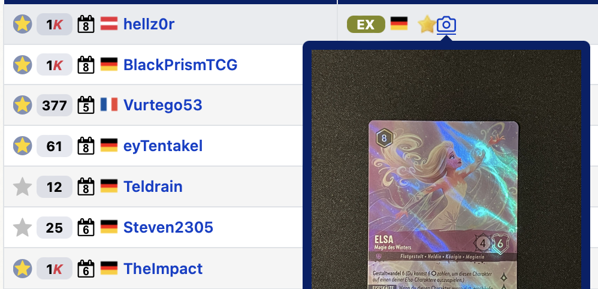
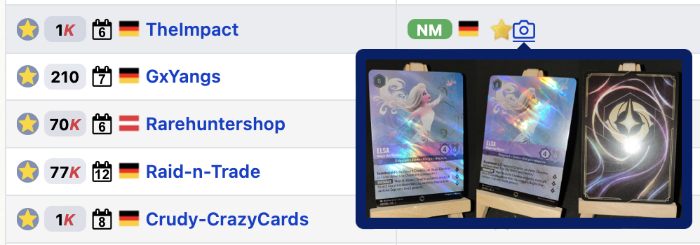

# Detect & Notice Counterfeit Lorcana Cards

Documentation of Fake Lorcana &amp; Counterfeit Lorcana cards

# What are fake cards ?

The counterfeit Lorcana cards or fake Lorcana cards can easily be purchased on platforms such as aliexpress.

Those are currently wildly resold on cardmarket and other platforms like tcgplayer. Those try to fight the fake cards but as a seller, you will want to be really cautious about what is happening right now.

# How to recognize a fake lorcana card ?

Fake cards have usually defects that can help distinguish them from actual real cards. However when it comes to Lorcana, The First Chapter and Rise Of The Floodborn proved themselves to be a little... under the expected quality. This is where this guide should help you sort everything out.

# Quick analysis

## Front of the cards

**Corners**

Real cards won't have corners like what regular trading card games, the corners are not smooth. They appear to be cut with an angle. _Warning ! The corners won't always have the same angle !_

**Description:** One of the expected corners

However fake cards will have a smooth and form a proper circle.

**Description:** In the above image, the card's corner on the left is the fake one

**Note:** _(Some?) Promotional cards will display a circular corner ! This is then harder to spot a fake Lorcana card_

**Print Quality**

When you look at the fake cards, you can see that the printing displays vertical lines that aren't present on the real cards.

One could even spot a fake cards by closely watching the printing dots. However without special equipments, this can be seen as quite difficult and most improbably to notice while checking online cards (compressions issues).

**Note:** _the various inconsistencies in the real cards won't help here as well. In some batches, the blurriness of the text could be interpreted as fake however those are true cards. So various "defects" can't be used as proof of fake_

## Back of the cards

This is where things get really really interesting, as opposed to some other Trading Card Game, when it comes to Lorcana, the fake cards have a sharper background. Whereas the regular Lorcana cards have some kind of smoother / blurrier background.

The fake cards will then show much more details than the real cards.

**Description:** The card on the left is the fake one

# "How To Buy" Guide

When it comes to online shopping on platforms like cardmarket.com or tcgplayer.com, it's important to notice that only the most valuable cards will have an higher probability of being fake. Enchanted cards such as Elsa will be harder to find as legitimate than ones that are less demanded.

This only makes the process a bit longer for shopping cards, not harder.

So what can you do :

- only buy from sellers who are displaying the cards they buy
- spot the corners (when possible)
- prefer the cards where you can see the back of the card
- don't buy the cards where the sellers are showing the card on a wooden pedestal ! (Spoiler: AliExpress)

With those 4 advice, you should lower the probability of buying a fake card. The hard part being spotting the corner as sometimes, due to the sleeves and photo quality, you won't be able to differentiate a smooth corner from the expected corner.

For instance, let's take cardmarket.com and the Enchanted Elsa from The First Chapter.

The card is as follow :

And here are some of the results on cardmarket :

Let's see some of the cards here :

And another one...

The first card seems legit, the angle are not smooth but we'll need to click on the image to see this (in this case, after clicking on it, it seems legit, the card can be normally safely bought)

But the second one is a direct no-go, don't buy this fake Lorcana card. The card quality is low, the corners are smooth and we can see that the back of the card is definitely a fake card. This seller ([TheImpact on CardMakret](https://www.cardmarket.com/fr/Lorcana/Users/TheImpact) only sell fake cards. At the time of writing this guide, cardmarket.com hasn't yet banned this seller)